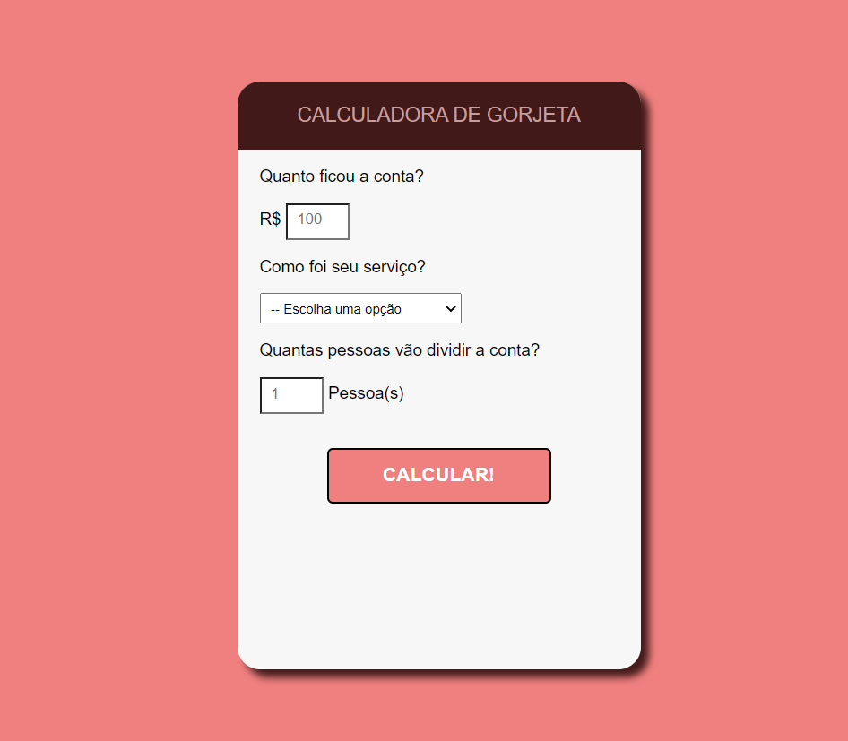
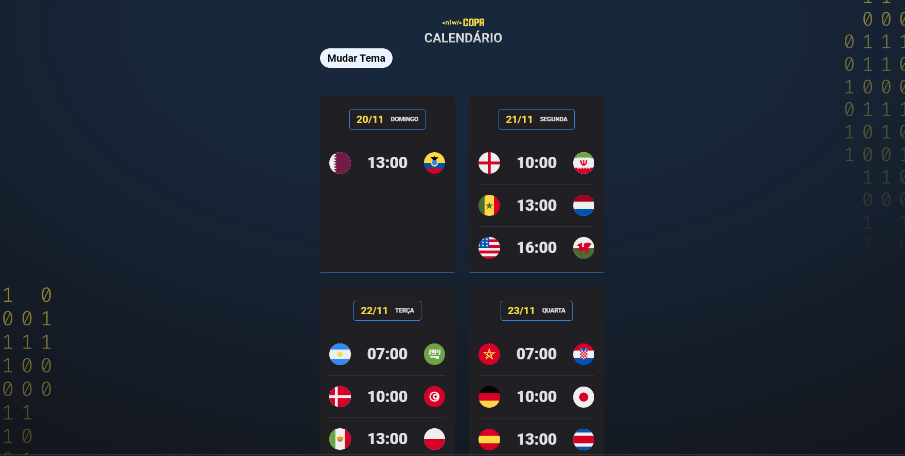
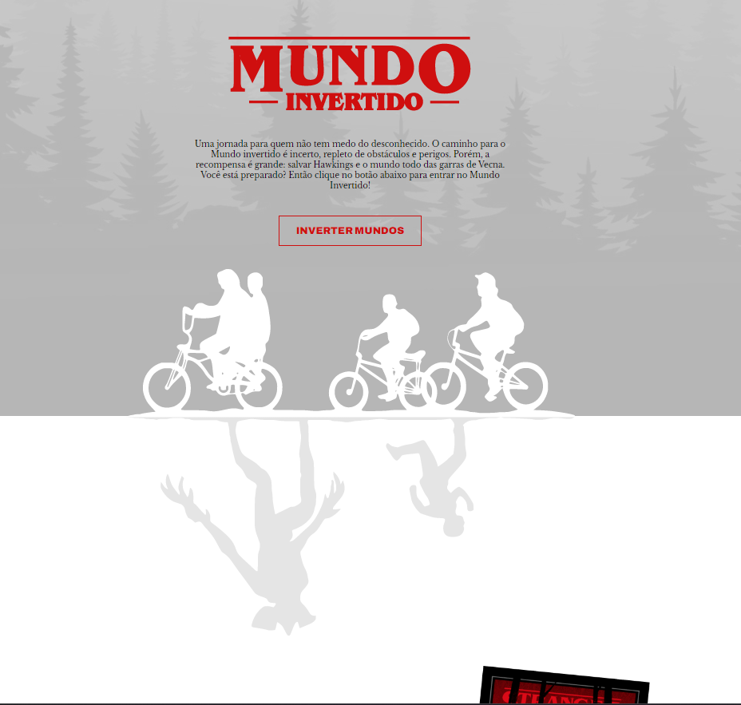
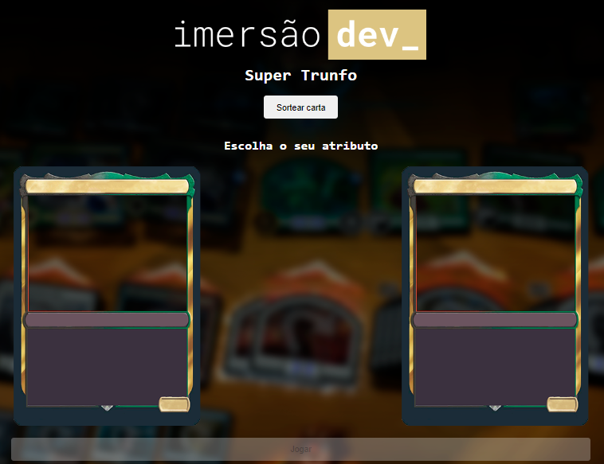
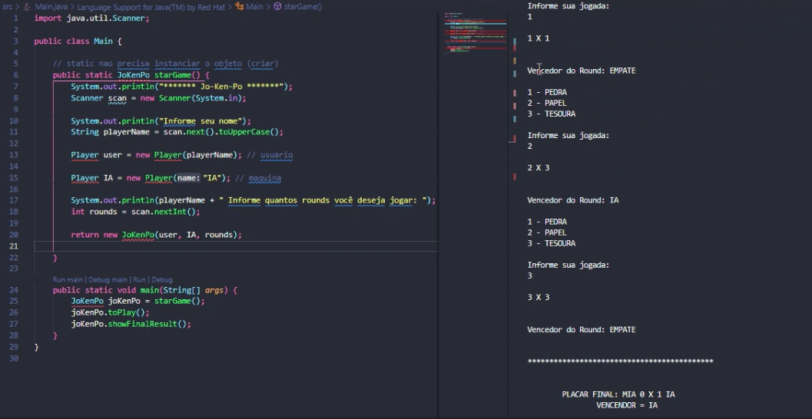
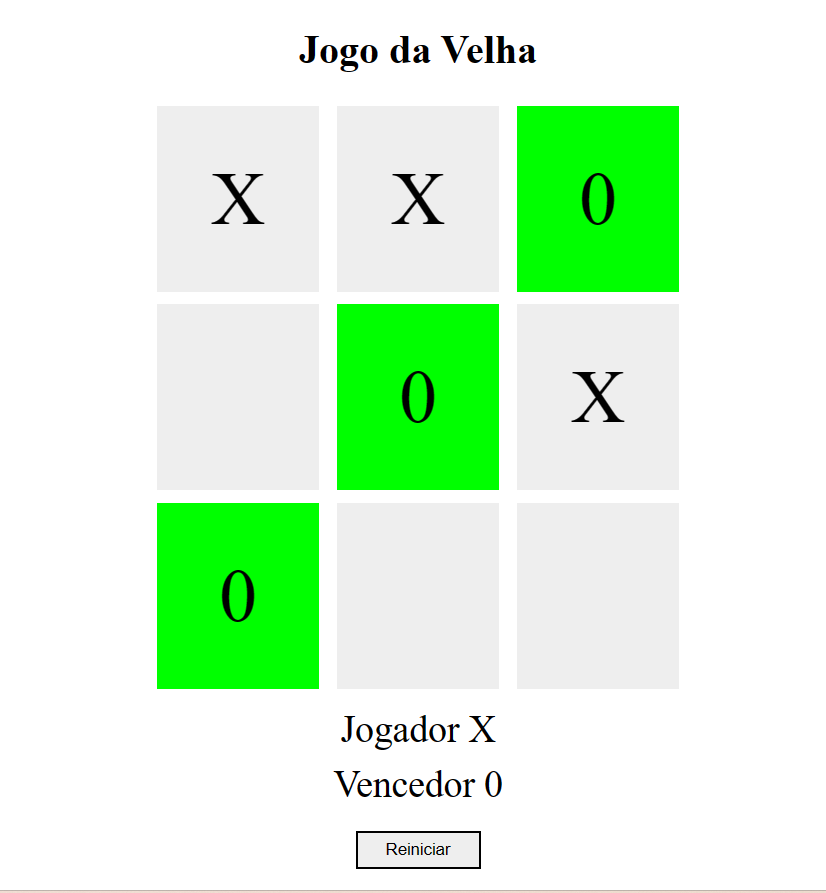
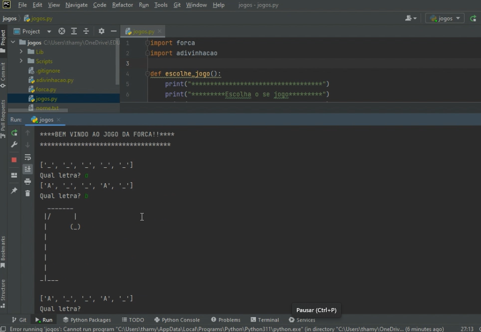

<h1 align="center"> PORTFÓLIO THAMYRES CAVALCANTE </h1>

 

Apresentação do meu portfólio com alguns dos meus projetos.

 

  <a href="#-tecnologias">Tecnologias</a>&nbsp;&nbsp;&nbsp;|&nbsp;&nbsp;&nbsp;  
  <a href="#-projetos">Projetos</a>&nbsp;&nbsp;&nbsp;&nbsp;&nbsp;&nbsp;  

 

## 🚀 Tecnologias

Para realizar os projetos foram utilizadas as seguintes tecnologias:
- HTML
- CSS
- Python
- Java
- Git e Github

 

## 💻 Projetos

Layout da tela da calculadora de gorjeta: 

Layout da tela do calendario da copa: 

Layout da tela no mundo invertido: 

Layout da tela interface da Netflix: 

Layout da tela do Super Trunfo: 

Layout da tela do jogo Jo-Ken-Pô: 

Layout da tela Jogo da Velha: 

Layout da tela jogos em Python: 

 

---

Feito com ♥ by Thamyres.