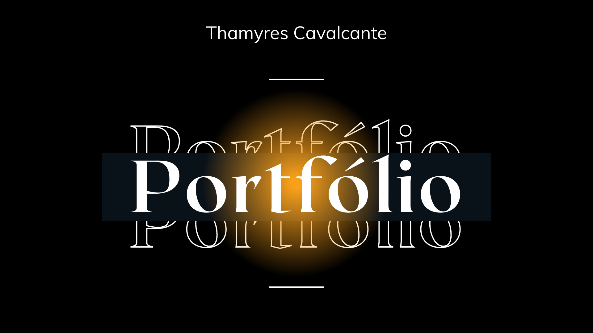

Apresentação de meu portfólio.

 

  <a href="#-tecnologias">Tecnologias</a>&nbsp;&nbsp;&nbsp;|&nbsp;&nbsp;&nbsp;  
  <a href="#-portfolio">Acesso ao Portfólio</a>&nbsp;&nbsp;&nbsp;&nbsp;&nbsp;&nbsp;  

 

## 🚀 Tecnologias

Os projetos realizados neste portfólio utilizaram as seguintes tecnologias:
- Java | Spring | Spring Boot
- Python | Django
- TomCat
- Front-end: HTML | CSS
- IDE: Eclipse  | VSCode | PyCharm
- Git e Github

 

## 📁 Acesso ao Portfólio

[Portfólio Thamyres Cavalcante](https://thamyresmya.github.io/Portfolio/).

 

- Me siga nas redes sociais:
- [Linkedin](https://www.linkedin.com/in/thamyrescavalcante/)
- [Instagran](https://www.instagram.com/thamyres__cavalcante/)

 

---

Feito com ♥ by Thamyres Cavalcante.